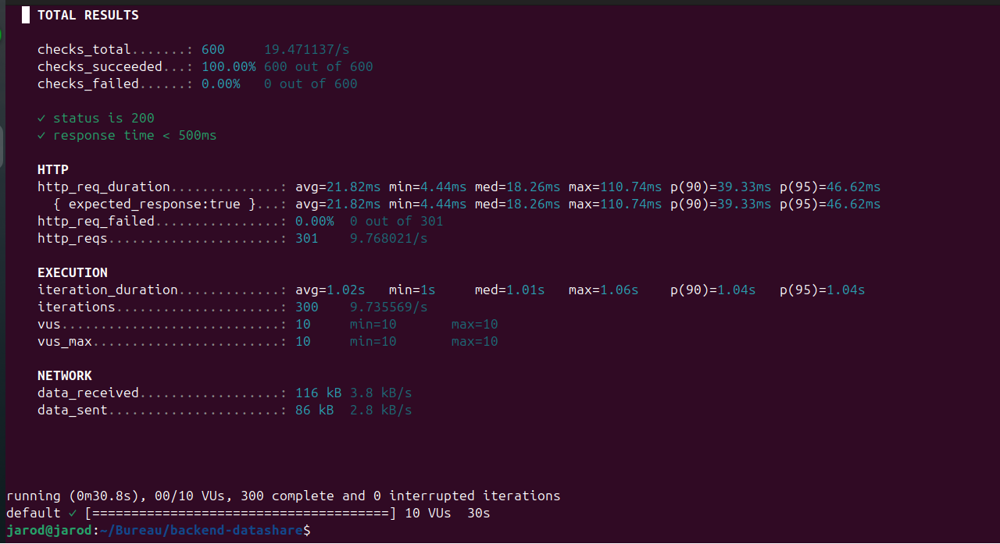

# PERF.md — DataShare Backend

## Test de performance

Outil utilisé : **k6 v1.6.1**  
Date du test : 04/06/2026  
Endpoint testé : `GET /api/files` (historique des fichiers)

### Configuration du test

| Paramètre | Valeur |
|---|---|
| Utilisateurs simultanés (VUs) | 10 |
| Durée | 30 secondes |
| Critère de succès | Status 200 + temps de réponse < 500ms |

### Résultats

| Métrique | Valeur |
|---|---|
| Requêtes totales | 300 |
| Taux de succès | 100% |
| Temps de réponse moyen | 21.82ms |
| Temps de réponse médian | 18.26ms |
| p(90) | 39.33ms |
| p(95) | 46.62ms |
| Temps de réponse maximum | 110.74ms |
| Requêtes par seconde | 9.77 req/s |
| Échecs | 0 |

### Interprétation

Les résultats sont excellents. L'endpoint `GET /api/files` répond en moyenne en **21ms** 
sous une charge de 10 utilisateurs simultanés, bien en dessous du seuil de 500ms défini.

Le p(95) à **46ms** indique que 95% des requêtes sont traitées en moins de 47ms, 
ce qui confirme la stabilité et la rapidité du backend même sous charge.

Le pic à 110ms observé sur le maximum est probablement lié à la première connexion 
à la base de données PostgreSQL (warm-up).

## Logs et métriques serveur

Les métriques Spring Boot sont disponibles via les logs de l'application au démarrage 
et pendant l'exécution. Aucune anomalie détectée pendant le test de performance.

## Budget de performance frontend

| Métrique | Objectif | Outil de vérification |
|---|---|---|
| Bundle initial | < 500kB | Angular build stats |
| First Contentful Paint | < 1.5s | Chrome DevTools |
| Time to Interactive | < 3s | Chrome DevTools |