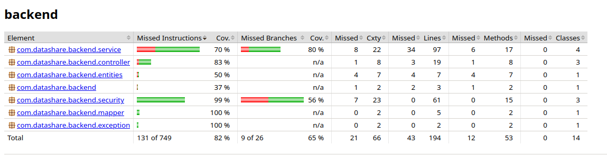

# TESTING.md — DataShare Backend

## Plan de tests

| Fonctionnalité | Type de test | Fichier | Critères d'acceptation |
|---|---|---|---|
| Création de compte | Unitaire + Intégration | `UserServiceTest`, `UserControllerTest` | HTTP 201, `UserResponseDTO` retourné |
| Connexion utilisateur | Unitaire + Intégration | `AuthServiceTest`, `AuthControllerTest` | HTTP 200, token JWT retourné |
| Upload de fichier | Intégration | `FileControllerTest` | HTTP 200, `name` et `token` présents dans la réponse |
| Téléchargement via token | Intégration | `FileControllerTest` | HTTP 200, métadonnées du fichier retournées |
| Historique des fichiers | Intégration | `FileControllerTest` | HTTP 200, liste retournée pour l'utilisateur connecté |
| Suppression de fichier | Intégration | `FileControllerTest` | HTTP 204, fichier supprimé |

## Instructions d'exécution

```bash
mvn test
```

Le rapport de couverture JaCoCo est généré automatiquement dans :


target/site/jacoco/index.html

## Rapport de couverture

Seuil cible : **70%**  
Couverture obtenue : **82%**



### Détail par package

| Package | Couverture instructions |
|---|---|
| security | 99% |
| controller | 83% |
| service | 70% |
| mapper | 100% |
| exception | 100% |
| entities | 50% |